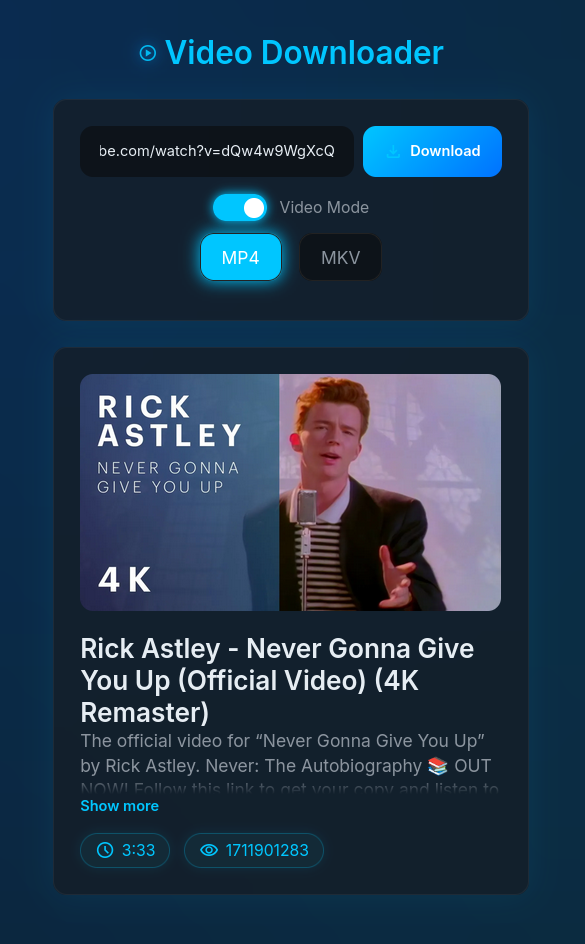

# MediaDownloader
A simple Flask web application that lets you download videos in different formats.

---
## Preview

 \
The interface provides a single input field for the video URL, a format selector, a preview of the videos metadata and of course a download button.

---

## Features

- Extracts video metadata via `yt-dlp`
- Downloads audio formats (MP3, WAV)
- Downloads or merges high-quality video format (MP4, MKV)
- Runs downloads in a background thread

---

## Tech Stack
| Component | Description |
|-----------|-------------|
| Flask | Python web framwork for backend |
| yt-dlp | Engine that extracts and downloads video/audio data |

---

## Installation
Make sure that FFmpeg is installed on your system. \
If not, install it with your package manager or from the [website](https://ffmpeg.org/download.html).
### Oneliner (Linux)
```bash
git clone https://github.com/pjwriteserrors/MediaDownloader.git && cd MediaDownloader && python -m venv venv && source venv/bin/activate && pip install -r requirements.txt && python app.py
```
### Oneliner (Windows)
```bash
git clone https://github.com/pjwriteserrors/MediaDownloader.git && cd MediaDownloader && python -m venv venv && venv\Scripts\activate && pip install -r requirements.txt && python app.py
```
Then open your browser at https://127.0.0.1:5000
### Manual
1. Clone the repo \
`git clone https://github.com/pjwriteserrors/MediaDownloader.git && cd MediaDownloader`
2. Set up a venv (optional) \
`python -m venv venv && source venv/bin/activate` \
or activate with `venv\Scripts\activate` on Windows.
3. Install dependencies \
`pip install -r requirements.txt`
4. Run it \
`python app.py` \
Then open your browser at https://127.0.0.1:5000

### Note
I recommend leaving the command prompt open to track progress and errors.